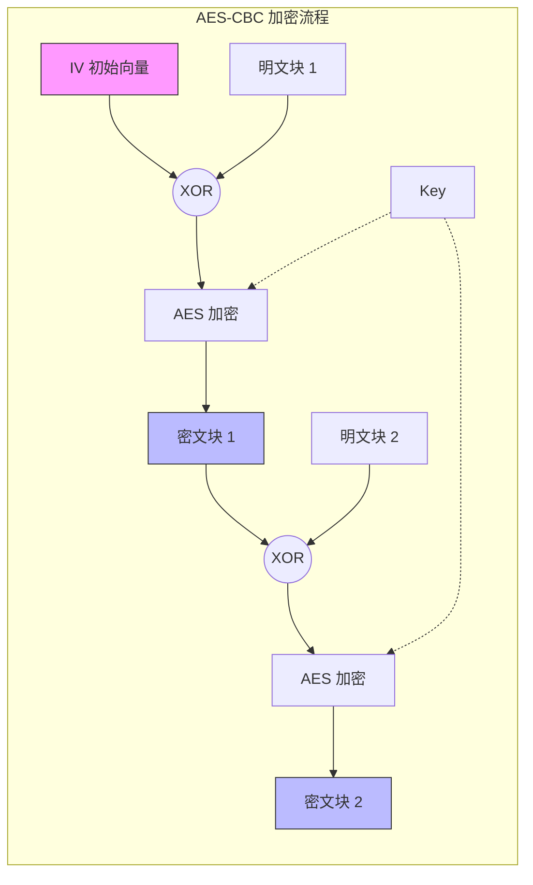

是的，**RC4 和 AES 都是对称加密算法**。这意味着加密和解密使用的是同一个密钥（Secret Key）。

虽然它们都是对称加密，但它们的内部工作原理（机制）截然不同，这也导致了它们对 **IV（初始化向量）** 和 **Padding（填充）** 的需求完全不同。

以下是详细的对比与原理解析：

---

### 1. 核心区别概览

|特性|RC4 (Rivest Cipher 4)|AES (Advanced Encryption Standard)|
|---|---|---|
|**类型**|**流密码 (Stream Cipher)**|**分组密码 (Block Cipher)**|
|**工作方式**|逐字节生成密钥流，与明文异或|将明文分成固定块（128位），对每块进行多轮变换|
|**是否需要 IV**|**强烈建议使用**（但在算法定义本身不是强制的，但在WEP等协议中因未正确使用IV导致被破解）|**需要**（取决于模式，如 CBC, GCM 等模式必须用 IV）|
|**是否需要 Padding**|**不需要**（因为是流密码，数据多长就处理多长）|**需要**（取决于模式，如 ECB, CBC 需要填充至块大小倍数；CTR, GCM 不需要）|
|**安全性**|**已不再安全**（已被弃用，存在严重漏洞）|**非常安全**（当前全球标准）|

---

### 2. RC4 (Rivest Cipher 4) 详解

RC4 是一种**流密码**。它的核心思想是：根据密钥生成一个无限长的、伪随机的字节流（Key Stream），然后将这个密钥流与明文进行异或（XOR）运算。

#### 是否需要 IV？

- **理论上：** RC4 算法本身只接受一个 Key。
- **实际上：** 为了避免相同的 Key 生成相同的密钥流（导致相同的明文加密成相同的密文），通常会将 IV 和 Key 拼接在一起作为种子密钥输入。**但是，RC4 对 IV 的处理非常糟糕**，这是导致 WEP（早期 Wi-Fi 加密）被破解的主要原因。

#### 是否需要 Padding？

- **不需要。** 流密码是逐字节处理的，明文有多长，密钥流就生成多长，密文也就多长。

#### 计算过程（原理）

RC4 分为两个主要阶段：

1. **KSA (Key-scheduling algorithm) - 密钥调度算法**
    
    - 初始化一个 0 到 255 的数组 `S`（S-Box），`S[i] = i`。
    - 使用密钥 `Key` 对 `S` 数组进行打乱（置换）。
    - _代码逻辑简述：_ 遍历 256 次，根据 Key 的值交换 S[i] 和 S[j] 的位置。
2. **PRGA (Pseudo-random generation algorithm) - 伪随机生成算法**
    
    - 这是加密阶段。不断地交换 `S` 数组中的元素，并输出一个字节 `K`。
    - _计算：_
        1. `i = (i + 1) % 256`
        2. `j = (j + S[i]) % 256`
        3. 交换 `S[i]` 和 `S[j]`
        4. 取出一个伪随机字节 `K = S[(S[i] + S[j]) % 256]`
    - **加密/解密：** `密文字节 = 明文字节 XOR K` （解密同理，再次 XOR 即可还原）。

---

### 3. AES (Advanced Encryption Standard) 详解

AES 是一种**分组密码**（Block Cipher）。它将数据切分成固定的块（AES 固定为 128 位，即 16 字节），然后对每一块进行加密。

#### 是否需要 IV？

- **需要（在大多数模式下）。**
- 如果使用 ECB 模式（电子密码本），不需要 IV，但这是**不安全**的，因为相同的明文块会产生相同的密文块（能看见企鹅图的轮廓）。
- 常用模式如 **CBC (密码块链接)**、**CFB**、**OFB**、**CTR**、**GCM** 都必须使用 IV（或 Nonce）。IV 的作用是引入随机性，确保即使明文相同，每次加密的结果也不同。

#### 是否需要 Padding？

- **取决于模式。**
- **CBC, ECB 模式：** 需要。因为 AES 处理的是 16 字节的块。如果最后一段数据只有 5 字节，必须填充 11 个字节凑齐 16 字节（常用 PKCS#7 Padding）。
- **CTR, GCM 模式：** 不需要。这些模式本质上把分组密码变成了流密码的工作方式，不需要填充。

#### 计算过程（原理）

AES 是一个迭代的、对称密钥分组的密码，可以使用 128、192 和 256 位密钥，并且用 128 位（16字节）分组加密和解密数据。

以 AES-128 为例，它包含 10 轮变换。每一轮包含四个步骤（最后一轮略有不同）：

1. **SubBytes (字节代换)：**
    
    - 这是一个非线性的替换步骤。通过一个查找表（S-Box），将输入的每个字节替换成另一个字节。这是 AES 抗差分攻击的关键。
2. **ShiftRows (行移位)：**
    
    - 将 16 个字节排成 4x4 的矩阵。
    - 第一行不变，第二行向左循环移 1 位，第三行移 2 位，第四行移 3 位。这起到了扩散作用。
3. **MixColumns (列混淆)：**
    
    - 对矩阵的每一列进行线性变换（矩阵乘法）。这一步让一个字节的变化能影响到该列的其他字节，进一步增强扩散性。（注：最后一轮不执行此步）。
4. **AddRoundKey (轮密钥加)：**
    
    - 将当前状态矩阵与该轮的“子密钥”进行异或（XOR）。子密钥是由主密钥通过“密钥扩展算法”生成的。

**总结 AES 计算流：**  
`明文 -> AddRoundKey(初始) -> [SubBytes -> ShiftRows -> MixColumns -> AddRoundKey] x 9轮 -> [SubBytes -> ShiftRows -> AddRoundKey] -> 密文`

---

### 4. 当前世界常用的对称加密算法

目前世界上对称加密算法的格局非常清晰，主要分为“主流标准”和“特定场景轻量级”两类。

#### A. 绝对霸主：AES (Rijndael)

- **地位：** 全球事实标准，NIST 认证，广泛用于 HTTPS (TLS), Wi-Fi (WPA2/3), 磁盘加密 (BitLocker), VPN 等。
- **推荐模式：**
    - **AES-GCM (Galois/Counter Mode)：** 目前最推荐。它不仅加密（保密性），还同时提供认证（完整性），且性能极高（可并行计算）。
    - **AES-CBC：** 传统模式，仍广泛使用，但需要处理 Padding 且容易受到 Padding Oracle 攻击，不如 GCM 现代。

#### B. 另一种强力选择：ChaCha20

- **地位：** Google 极力推崇，现已成为 TLS 1.3 的标准算法之一。
- **特点：**
    - 它是**流密码**（类似 RC4 的定位，但设计极其安全）。
    - **性能：** 在没有 AES 硬件加速指令集（AES-NI）的移动设备（如旧手机、IoT 设备）上，ChaCha20 的速度比 AES 快得多，且更省电。
    - **组合：** 通常与 Poly1305（消息认证码）配合使用，称为 **ChaCha20-Poly1305**。

#### C. 旧时代的残党（不推荐使用）

- **DES / 3DES：** 块太小（64位），速度慢，且易被暴力破解。已被废弃。
- **RC4：** 存在统计偏差，已被彻底攻破，在 TLS 中已被禁用。
- **Blowfish：** 曾经流行，但块大小只有 64 位，现在被认为不再适合加密大量数据（容易发生碰撞）。其继任者 **Twofish** 是 AES 竞选的决赛选手之一，非常安全但速度稍逊 AES。

### 总结建议

- 如果你在开发新系统，**首选 AES-256-GCM**。
- 如果你的设备没有硬件 AES 加速（如低端嵌入式芯片），**首选 ChaCha20-Poly1305**。
- **永远不要**再使用 RC4、DES 或 ECB 模式的 AES。

### 总结图表

|算法|类型|安全性|速度 (有硬件加速)|速度 (无硬件加速)|现状|
|---|---|---|---|---|---|
|**AES**|分组密码|⭐⭐⭐⭐⭐ (极高)|⭐⭐⭐⭐⭐ (极快)|⭐⭐⭐ (中等)|**世界霸主，首选标准**|
|**ChaCha20**|流密码|⭐⭐⭐⭐⭐ (极高)|⭐⭐⭐⭐|⭐⭐⭐⭐⭐ (极快)|**移动端/软路由首选**|
|**RC4**|流密码|⭐ (极低，已破)|⭐⭐⭐⭐⭐|⭐⭐⭐⭐⭐|**已淘汰，禁止使用**|
|**SM4**|分组密码|⭐⭐⭐⭐⭐ (极高)|⭐⭐⭐⭐|⭐⭐⭐|**中国国标，合规首选**|
|**3DES**|分组密码|⭐⭐ (较低)|⭐|⭐|**正在淘汰**|

**一句话建议：**  
如果你在开发系统，**首选 AES-128-GCM 或 AES-256-GCM**；如果是针对移动端优化或没有 AES 硬件加速的场景，使用 **ChaCha20-Poly1305**。

是一个非常专业且切中要害的问题。

**答案是肯定的：IV（初始化向量）非常重要。** 甚至可以说，在现代密码学工程实践中，IV 的管理（随机性、唯一性）比密钥本身的保密性还要容易出错，且一旦出错后果极严重。

除了 IV 和 Key（密钥），对称加密中还有几个至关重要的“隐藏参数”，如 **Mode（模式）**、**Padding（填充）**、**Nonce（随机数）**、**Tag（认证标签）** 和 **AAD（附加认证数据）**。

下面我将为你详细拆解对称加密的完整生态，并用可视化图表展示其流程。

---

### 一、 为什么必须要有 IV (Initialization Vector)？

想象一下，你和我在用同一个密钥（Key）进行通信。  
如果我发给你消息：“Hello”，加密后变成了 `X8s9...`。  
明天我又发给你：“Hello”，加密后**依然**是 `X8s9...`。

这就出大事了：

1. **模式泄露**：攻击者虽然解不开密文，但他能看出你发送了重复的内容。如果这是银行转账指令，攻击者可以截获这段密文，然后重放（Replay）给银行，导致你转账两次。
2. **字典攻击**：攻击者可以建立一个数据库，记录常见单词对应的密文。

**IV 的作用就是“引入随机性”**。  
IV 是一个随机生成的比特块，它会在加密的第一步就混入数据中。

- 第一次加密 "Hello" + IV1 -> 密文 A
- 第二次加密 "Hello" + IV2 -> 密文 B

**虽然明文和密钥都没变，但因为 IV 变了，密文就完全变了。**

> **注意**：IV 不需要保密，它通常会明文附带在密文的最前面传给对方。解密时，对方先读出 IV，再用它来初始化解密引擎。

---

### 二、 对称加密的核心参数全景图

除了 Key 和 IV，一个完整的现代对称加密系统（如 AES）还需要确定以下参数：

#### 1. Mode of Operation（加密模式）

AES 本身只是一个能在 16 字节（128位）数据块上进行数学变换的“引擎”。它一次只能处理 128 位。如果你有一个 1GB 的文件，怎么用这个 16 字节的引擎去加密？这就需要**模式**。

- **ECB (Electronic Codebook)**：**最危险，严禁使用**。它把文件切块，每块独立加密。相同的明文块会生成相同的密文块（企鹅图效应）。不需要 IV。
- **CBC (Cipher Block Chaining)**：**经典模式**。前一块的密文会与当前块的明文进行异或（XOR）运算。第一块没有前一块，所以需要 **IV**。
- **CTR (Counter)**：**流式模式**。把块加密变成了流加密，速度极快，可并行计算。需要 **Nonce**（类似 IV）。
- **GCM (Galois/Counter Mode)**：**现代标准，推荐使用**。它不仅加密（保密性），还提供**完整性校验**。它是 AEAD（关联数据的认证加密）的一种。

#### 2. Padding（填充）

大多数分组密码（如 AES-CBC）要求数据长度必须是块大小（16字节）的整数倍。如果你的消息只有 3 个字节怎么办？

- 必须填充 13 个字节的废数据，凑齐 16 字节。
- 最常用的标准是 **PKCS#7**。
- _注：CTR 和 GCM 模式不需要填充，因为它们变成了流密码。_

#### 3. Tag (Authentication Tag / MAC)

这是 **GCM** 等现代模式特有的。

- **作用**：防止篡改。
- **原理**：加密完成后，算法会吐出一个 `Tag`（通常 16 字节）。解密时，必须输入密文 + Tag。如果密文在传输途中被黑客修改了哪怕 1 个比特，解密运算算出的 Tag 就会和输入的 Tag 不一致，解密直接报错失败。
- _没有 Tag 的老式加密（如 CBC）无法发现数据是否被篡改。_

#### 4. AAD (Additional Authenticated Data)

这是 **AEAD (Authenticated Encryption with Associated Data)** 流程中的参数。

- **场景**：网络包的包头（Header）包含路由信息，不能加密（否则路由器看不懂），但必须防止被篡改。
- **做法**：把包头作为 AAD 传入加密算法。AAD 不会被加密，但会参与 Tag 的计算。如果包头被改，Tag 校验也会失败。

---

### 三、 深度可视化：加密流程演示

为了让你彻底理解 **CBC（经典）** 和 **GCM（现代）** 的区别，我编写了一个交互式的 HTML 演示。

### 四、 文字版详细总结

#### 1. 为什么 AES-CBC 图中密文要连到下一块？

这就是 **Chaining（链式）** 的含义。

- 密文块 1 是生成密文块 2 的“原料”之一。
- 这意味着：**只要明文块 1 发生了一丁点变化，后面所有的密文块（2, 3, 4...）都会完全改变**。这提供了极好的“雪崩效应”。
- 但也意味着：你不能直接解密第 100 块数据，你必须把前面的都算一遍（或者至少知道前一块的密文）。

#### 2. AES-GCM 为什么不需要 Padding？

GCM 内部使用的是 **CTR（计数器）模式**。

- 它的原理不是“加密明文”，而是“加密一个计数器（1, 2, 3...）”生成一串随机的**密钥流（Key Stream）**。
- 然后，把这个密钥流和明文做 **XOR（异或）** 运算。
- 异或运算不要求长度对齐，明文多长，密钥流就截取多长。所以不需要填充。

#### 3. 开发者最容易犯的错误：Nonce Reuse (Nonce 重用)

在 GCM 模式中，**Nonce（即 IV）绝对不能重复**。  
如果你用同一个 Key 和同一个 Nonce 加密了两段不同的明文：  
C1=P1⊕KstreamC1 = P1 \oplus K_{stream}C1=P1⊕Kstream​  
C2=P2⊕KstreamC2 = P2 \oplus K_{stream}C2=P2⊕Kstream​  
攻击者只要把两个密文异或一下：$C1 \oplus C2$，密钥流就抵消了，结果等于 $P1 \oplus P2$（两段明文的异或值）。这实际上已经泄露了大量明文信息。

### 总结

当你使用对称加密时，请检查你的工具箱里是否具备了以下要素：

1. **Key**：高强度的随机密钥。
2. **Algorithm**：推荐 **AES**。
3. **Mode**：首选 **GCM**（如果环境不支持，次选 CBC）。
4. **IV / Nonce**：**每次加密都必须生成一个新的随机值**，并将其放在密文头部传给解密方。
5. **Tag**：如果是 GCM，解密时一定要校验 Tag，防止数据被篡改。