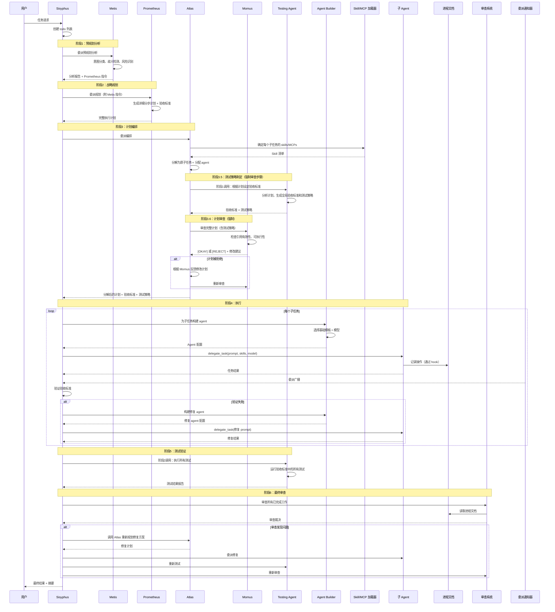

```sequenceDiagram
    participant U as 用户
    participant S as Sisyphus
    participant Met as Metis
    participant Pro as Prometheus
    participant SMA as Skill/MCP Allocator
    participant Mom as Momus
    participant Exec as 执行 Agent
    participant TR as Test Runner

    U->>S: 任务请求
    
    Note over S,Met: 阶段1：预规划分析
    S->>Met: 委派预规划分析
    Met-->>S: 分析报告 + Prometheus 指令
    
    Note over S,Pro: 阶段2：战略规划
    S->>Pro: 委派规划（附 Metis 指令）
    Pro-->>S: 完整计划（含验收标准，无 Skill/MCP）
    
    Note over S,SMA: 阶段3：Skill/MCP 分配
    S->>SMA: 为计划分配 Skills/MCPs
    SMA-->>S: 带 Skill/MCP 的计划
    
    Note over S,Mom: 阶段4：计划审查（Momus）
    S->>Mom: 审查计划（含验收标准 + Skill/MCP）
    Mom-->>S: [OKAY] 或 [REJECT]
    
    alt 计划被拒绝
        S->>Pro: 根据 Momus 反馈修改计划
        Pro-->>S: 修改后的计划
        S->>SMA: 重新分配 Skills/MCPs
        S->>Mom: 重新审查
    end
    
    Note over S,Exec: 阶段5：执行
    loop 逐一执行子任务
        S->>Exec: delegate_task（含 skills + mcps）
        Exec-->>S: 结果
    end
    
    Note over S,TR: 阶段6：测试验证
    S->>TR: 执行验收标准
    TR-->>S: 测试结果
```
