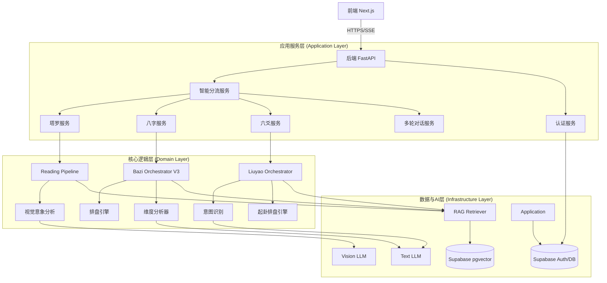

****# 系统设计文档 (SDD)

## 1. 文档概述

### 1.1 文档目的
本文档旨在定义“归命”AI占卜系统的技术架构、数据模型、接口规范及核心算法实现逻辑，为开发团队提供详细的技术指导。

### 1.2 适用范围
本文档适用于后端开发、前端开发、AI工程师及测试人员。

### 1.3 技术栈概览
- **前端**: Next.js 14 (App Router), React 18, TypeScript, Tailwind CSS
- **后端**: FastAPI (Python 3.11+), Uvicorn
- **数据库**: Supabase (PostgreSQL), pgvector (向量检索)
- **AI/LLM**: OpenAI/DeepSeek/Gemini API
- **基础设施**: Railway / Vercel

---

## 2. 系统架构设计

### 2.1 总体架构图

### 2.2 核心模块设计

#### 2.2.1 塔罗占卜模块 (`tarot/reading_pipeline.py`)
- **设计模式**: 管道模式 (Pipeline)
- **处理流程**:
  1. `QuestionAnalyzer`: 分析问题意图，决定牌阵。
  2. `CardSelection`: 模拟抽牌随机性。
  3. `PatternAnalyzer`: 分析牌阵中的元素分布（花色、数字、逆位）。
  4. `ImageryGenerator`: **关键特性**，调用Vision模型分析牌面视觉细节。
  5. `RAGRetriever`: 检索《78 Degrees》等知识库。
  6. `InterpretationGenerator`: 综合生成最终解读。
- **流式输出**: 通过 Python generator 实现 SSE (Server-Sent Events) 推送。

#### 2.2.2 八字排盘模块 (`bazi/core/orchestrator_v3.py`)
- **设计模式**: 编排器模式 (Orchestrator) + 策略模式
- **核心逻辑**:
  - 采用**渐进式分析 (Progressive Analysis)** 架构。
  - **排盘**: 计算真太阳时，调用 `bazi_paipan_latest` 库生成四柱。
  - **维度分析**: 并行执行多个 `DimensionAnalyzer` (格局、神煞、日时断、月令用神)。
  - **RAG增强**: 针对每个维度构建特定的查询向量，检索古籍（渊海子平、三命通会）。

#### 2.2.3 六爻占卜模块 (`liuyao/orchestrator.py`)
- **设计模式**: 编排器模式 (Orchestrator)
- **核心逻辑**:
  1.  **意图识别 (`IntentAnalyzer`)**: 分析用户问题，提取关键信息（如所测何事）。
  2.  **起卦排盘 (`GuaEngine`)**: 支持时间起卦和手动起卦，生成本卦、变卦及六亲六兽。
  3.  **RAG检索**: 根据卦象和问题意图，检索相关的断语和古籍案例。
  4.  **LLM推理**: 结合排盘数据和检索到的知识，生成最终的吉凶判断和建议。

#### 2.2.4 智能分流模块 (`divination_router.py`)
- **功能**: 基于用户问题的语义分析，自动路由到最佳占卜工具。
- **逻辑**:
  - 输入: 用户问题 (String)
  - 输出: 占卜类型 (tarot/bazi/liuyao), 置信度 (Float), 理由 (String)
  - 实现: 使用轻量级 LLM (如 GPT-4o-mini) 进行意图分类。

---

## 3. 数据模型设计 (Database Schema)

基于 Supabase (PostgreSQL) 的表结构设计。

### 3.1 核心业务表

#### `readings` (塔罗占卜记录)
| 字段名 | 类型 | 说明 |
| :--- | :--- | :--- |
| `id` | UUID | 主键 |
| `user_id` | UUID | 关联 user_profiles |
| `question` | TEXT | 用户问题 |
| `spread_type` | VARCHAR | 牌阵类型 (three_card, celtic_cross) |
| `cards` | JSONB | 抽取的卡牌数组及位置信息 |
| `interpretation` | TEXT | 最终解读内容 |
| `visual_analysis` | JSONB | **新增** 视觉意象分析数据 |
| `created_at` | TIMESTAMPTZ | 创建时间 |

#### `bazi_paipan_results` (八字排盘结果)
| 字段名 | 类型 | 说明 |
| :--- | :--- | :--- |
| `id` | UUID | 主键 |
| `birth_time` | TIMESTAMPTZ | 出生时间 (ISO 8601) |
| `gender` | VARCHAR | 性别 |
| `longitude` | FLOAT | 经度 (用于真太阳时) |
| `paipan_data` | JSONB | 完整的四柱、大运、流年结构化数据 |

#### `bazi_comprehensive_analyses` (八字综合分析)
| 字段名 | 类型 | 说明 |
| :--- | :--- | :--- |
| `id` | UUID | 主键 |
| `paipan_id` | UUID | 关联排盘结果 |
| `analysis_text` | TEXT | 综合解读文本 |
| `rag_references` | JSONB | 引用的古籍片段 |

#### `liuyao_readings` (六爻占卜记录)
| 字段名 | 类型 | 说明 |
| :--- | :--- | :--- |
| `id` | UUID | 主键 |
| `user_id` | UUID | 关联 user_profiles |
| `question` | TEXT | 用户问题 |
| `gua_data` | JSONB | 卦象数据（本卦、变卦、六亲等） |
| `result` | TEXT | 最终解读结果 |
| `rag_results` | JSONB | 检索到的相关知识片段 |
| `created_at` | TIMESTAMPTZ | 创建时间 |

### 3.2 向量知识库表

#### `bazi_rag_chunks`
| 字段名 | 类型 | 说明 |
| :--- | :--- | :--- |
| `id` | UUID | 主键 |
| `content` | TEXT | 古籍原文片段 |
| `embedding` | VECTOR(1536) | 向量数据 (pgvector) |
| `metadata` | JSONB | 书名、章节、标签 (e.g., {"book": "三命通会", "category": "格局"}) |

#### `liuyao_rag_chunks`
| 字段名 | 类型 | 说明 |
| :--- | :--- | :--- |
| `id` | UUID | 主键 |
| `content` | TEXT | 六爻断语或案例 |
| `embedding` | VECTOR(1536) | 向量数据 |
| `metadata` | JSONB | 分类、来源 |

---

## 4. 接口设计 (API Design)

### 4.1 塔罗接口
- **POST** `/api/tarot/reading`
  - **功能**: 创建流式占卜
  - **Request**: `{ "question": "...", "spread_type": "auto" }`
  - **Response**: SSE Stream (Event: `progress`, `card_draw`, `visual_analysis`, `interpretation`)

### 4.2 八字接口
- **POST** `/api/v1/bazi/analyze`
  - **功能**: 八字排盘与分析 (流式)
  - **Request**: `{ "birth_time": "...", "gender": "...", "longitude": 116.4 }`
  - **Response**: SSE Stream (包含排盘数据 JSON 和 流式文本)

### 4.3 六爻接口
- **POST** `/api/v1/liuyao/divination/stream`
  - **功能**: 六爻占卜 (流式)
  - **Request**: `{ "question": "...", "location": {...} }`
  - **Response**: SSE Stream (Event: `progress`, `gua_data`, `interpretation`)

### 4.4 智能分流
- **POST** `/api/v1/divination/route`
  - **功能**: 获取推荐占卜方式
  - **Response**: `{ "type": "tarot", "reason": "...", "redirect_url": "/..." }`

---

## 5. 性能与安全设计

### 5.1 性能优化
1.  **RAG 缓存**: 对高频查询的 Embedding 结果进行 Redis 缓存，减少向量数据库查询。
2.  **并发控制**: 使用 `asyncio.Semaphore` 限制 RAG 检索和 LLM 请求的并发数 (默认 10)。
3.  **排盘复用**: 相同的 `birth_time` + `gender` + `longitude` 直接复用 `bazi_paipan_results`，避免重复计算。

### 5.2 安全策略
1.  **RLS (Row Level Security)**: 在 Supabase 层开启 RLS，确保用户只能访问 `user_id` 匹配的记录。
2.  **API Key 轮询**: 后端维护 API Key 池，避免单点限流。
3.  **敏感数据脱敏**: 日志中自动脱敏用户具体问题和出生地点信息。

---

## 6. 部署架构

- **CI/CD**: GitHub Actions 自动部署
- **环境**:
  - Frontend: Vercel (Edge Network)
  - Backend: Railway (Containerized)
  - Database: Supabase Cloud
